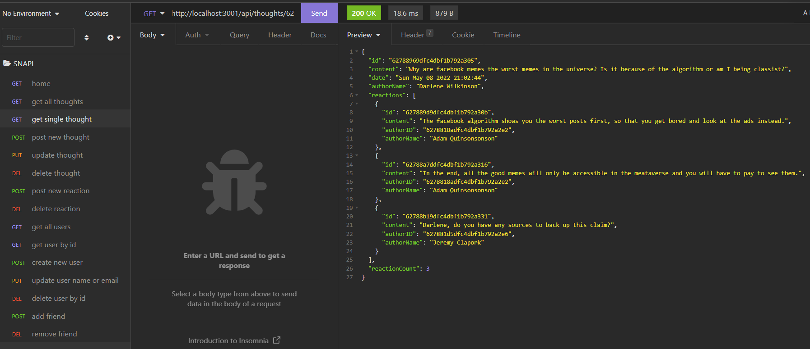

# SNAPI

This is a server for a social network that allows one to create users, add thoughts and associated reactions, as well as link users as friends.  

Usage: once deployed, locally or remotely, the home url (GET http://localhost:3001/ if deployed locally) returns a list of valid api calls with the required parameters and bodies. 
This program can be deployed with no modifications to Heroku for the server and Mongo Atlas for the database. 

Please find the a demonstration video with first 11 api calls here: <a href="https://watch.screencastify.com/v/nXs2iulKTi9l2EGHmxZD">Demo Video 1</a> 
Second demonstration video with the last 2 api calls: <a href="https://watch.screencastify.com/v/CKyCl97PWSRImJE4GKLX">Demo Video 2</a>  

  
For any questions please email me: <a href="mailto:nialvo@protonmail.com">Email</a>